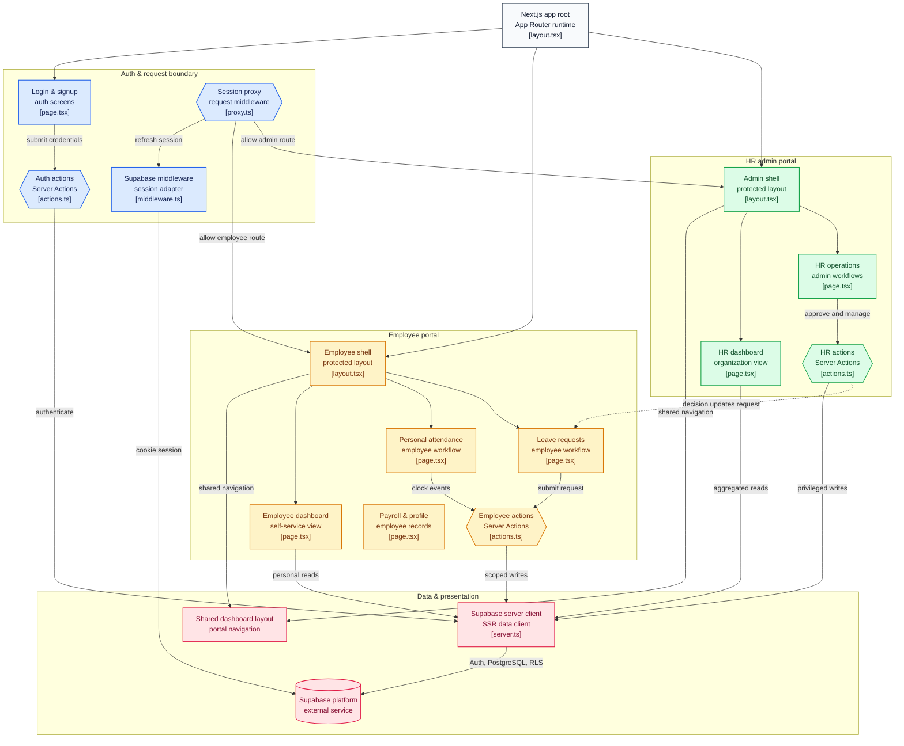

# 🌌 Dayflow — Enterprise Human Resource Management System

> **Every workday, perfectly aligned.**  
> A premium, dark-themed SaaS application engineered to streamline core human resource operations, built for speed, security, and scalability.

Dayflow is a modern HRMS featuring strict Role-Based Access Control (RBAC), real-time attendance tracking, leave application pipelines, and payroll management. It provides a seamless experience with dedicated, isolated portals for standard Employees and privileged HR Administrators.

---

## ✨ Core Features

### 1. Role-Based Access Control & Authentication

- **Dual-Portal System:** Distinct routing and UI experiences for `Employee` and `HR / Admin` roles.
- **Secure Onboarding:** HR account creation is strictly protected by a server-side `ADMIN_SECRET` to prevent privilege escalation.
- **Persistent Sessions:** Powered by Supabase Auth with secure HTTP-only cookies and Next.js middleware routing guards.

### 2. Interactive Dashboards

- **Employee Dashboard:** Quick-access metric cards (Profile, Attendance, Leave), current status indicators, and a recent activity notification feed.
- **HR Dashboard:** High-level enterprise metrics, live employee counts, and pending request trackers.

### 3. Attendance Management

- **Employee View:** Daily check-in and check-out tracking with timestamp logging and current-day status indicators.
- **Admin View:** Global, company-wide daily attendance logs to monitor the active workforce.

### 4. Leave & Time-Off Pipeline

- **Employee Self-Service:** Submit requests specifying leave type (Paid, Sick, Unpaid), date ranges, and optional remarks, alongside a personal request history table.
- **Admin Adjudication:** Centralized queue for HR to review, approve, or reject pending leave applications organization-wide.

---

## 🛠️ Tech Stack & Architecture

- **Framework:** [Next.js 16](https://nextjs.org/) (App Router, Server Actions, Turbopack)
- **Language:** TypeScript
- **Styling:** Tailwind CSS v4 + [shadcn/ui](https://ui.shadcn.com/)
- **Icons:** Lucide React
- **Database & Auth:** [Supabase](https://supabase.com/) (PostgreSQL, Row Level Security)
- **Deployment:** Vercel

### Application Architecture



---
🚀 Local Development Setup

Follow these steps to run Dayflow on your local machine.

1. Clone the Repository
git clone https://github.com/your-username/dayflow.git
cd dayflow
2. Install Dependencies
npm install
3. Environment Variables

Create a .env.local file in the root directory. You will need a Supabase project for the database credentials.

NEXT_PUBLIC_SUPABASE_URL=your_supabase_project_url

NEXT_PUBLIC_SUPABASE_ANON_KEY=your_supabase_anon_key

ADMIN_SECRET=dayflowadmin2026

4. Start the Development Server
npm run dev

Navigate to http://localhost:3000.

The middleware will automatically redirect you to the login screen.

🌐 Deployment (Vercel)

Dayflow is optimized for zero-config deployment on Vercel.

Push your code to a GitHub repository.
Log into Vercel and click Add New Project.
Import your Dayflow repository.
Critical: In the deployment settings, add your three Environment Variables:
NEXT_PUBLIC_SUPABASE_URL
NEXT_PUBLIC_SUPABASE_ANON_KEY
ADMIN_SECRET
Click Deploy.

Vercel will handle the build process and provide a live production URL in under 2 minutes.

🔮 Future Enhancements (Post-Hackathon)

While the core MVP is fully functional, the architecture is designed to scale. Planned future updates include:

Analytics Dashboard: Integration with Recharts for visual data representation of attendance trends and leave distributions.
Automated PDF Generation: Using react-pdf to dynamically generate and email actual payroll slips to employees.
Bulk Onboarding: A CSV upload pipeline for HR to mass-import employee profiles during company onboarding.
Shift Scheduling: A calendar interface for assigning specific working hours and shifts to different departments.
Email Notifications: Webhook integrations with Resend/SendGrid to notify employees when their leave is approved/rejected.

## 📂 Project Structure
```text
dayflow/
├── app/
│   ├── (auth)/             # Authentication routes (Login, Signup)
│   ├── admin/              # HR-exclusive routes
│   │   ├── attendance/     # Global attendance logs
│   │   ├── dashboard/      # HR metrics overview
│   │   ├── employees/      # Company-wide personnel directory
│   │   ├── leave/          # Leave request approval queue
│   │   └── payroll/        # Salary structure management
│   ├── employee/           # Employee-exclusive routes
│   │   ├── attendance/     # Personal clock-in/out
│   │   ├── dashboard/      # Personal overview & alerts
│   │   ├── leave/          # Leave application form & history
│   │   ├── payroll/        # Salary history & slips
│   │   └── profile/        # Personal details view
│   ├── auth/               # Server actions for Supabase Auth handling
│   ├── layout.tsx          # Root layout & global font configuration
│   └── globals.css         # Tailwind directives & custom scrollbars
├── components/
│   ├── layout/             # Application shell, responsive sidebar, headers
│   └── ui/                 # Reusable shadcn/ui primitives
├── lib/
│   └── supabase/           # Supabase SSR client configurations
└── middleware.ts           # Edge middleware for route protection & redirects
